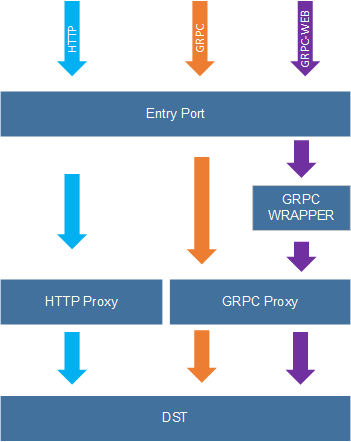

# rproxy

rproxy supports transparent proxy for multiple protocols(HTTP1.*/gRPC/gRPC-Web) with single port

## Protocols

| protocol                                     | desc         |
| -------------------------------------------- | ------------ |
| HTTP 1.*                                     |
| [gRPC](https://github.com/grpc)              | Native gRPC  |
| [gRPC-Web](https://github.com/grpc/grpc-web) | gRPC for web |
 

## Structure

## Reference

rproxy use the following package:

| package                 | desc                                      | link                                          |
| ----------------------- | ----------------------------------------- | --------------------------------------------- |
| cmux                    | serve different services on the same port |     github.com/soheilhy/cmux                  |
| improbable-eng/grpc-web | in process grpc-web wrapper               | github.com/improbable-eng/grpc-web/go/grpcweb |
| proxy                   | gRPC reverse proxy                        | github.com/mwitkow/grpc-proxy/proxy           |
